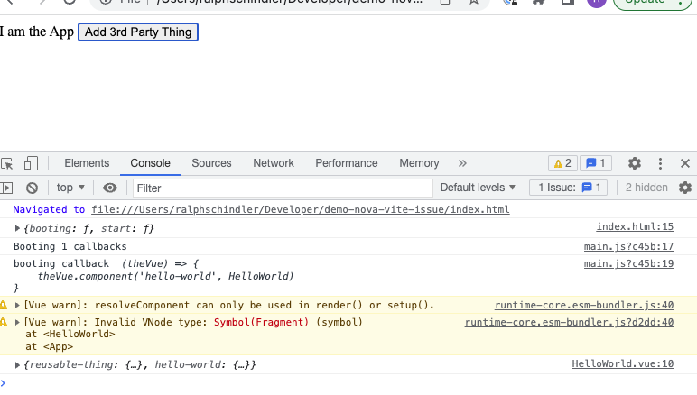

# Issue between Vite HMR components and webpacked global instances

```console
cd thirdparty
npm run dev
```

open `index.html` in chrome, with dev tools. upon clicking button will
get the issue with resolveComponent()



### Notes

Nova's structure is mocked in this particular case.  The one substantial change
is that what is normally liftOff is wrapped in a window event so that the vite
based `type="module"` is loaded before liftOff would be called (this change would
have to happen in Nova).